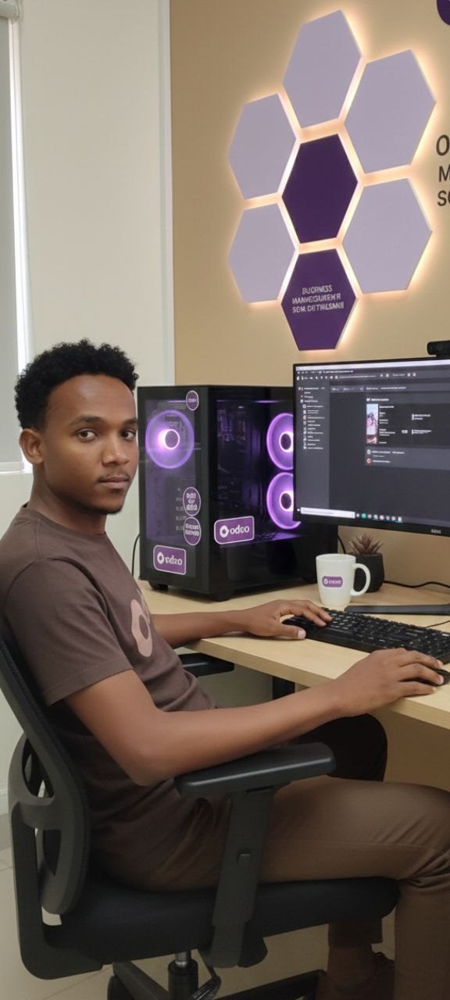

# Tewodros Wubete — Portfolio

Portfolio of **Tewodros Wubete** — Senior ERP Developer | Odoo Expert | Flutter Developer | Software Solution Architect.

A fast, accessible, single-page portfolio built with **plain HTML, CSS, and JavaScript** — no build step, no dependencies. Hosted for free on **GitHub Pages**: https://tewodroswubete.github.io/portfolio

## ✨ Features

- Dark / light theme toggle (remembers your choice)
- Fully responsive (mobile, tablet, desktop)
- Smooth scroll-reveal animations
- Accessible: skip link, focus styles, semantic markup, `prefers-reduced-motion` support
- Zero dependencies — just open `index.html`

## 📁 Structure

```
my_portifolios/
├── index.html      # All page content (edit your text here)
├── styles.css      # Theme & layout (edit colors at the top under :root)
├── script.js       # Theme toggle, menu, scroll animations
├── assets/         # Put your profile photo / images here
└── README.md
```

## ✏️ How to customize

Everything you need to edit is marked with `EDIT` comments in `index.html`.

1. **Social links** — search for `your-username` and replace the GitHub & LinkedIn URLs.
2. **Profile photo** — add `assets/profile.jpg`, then in `index.html` replace the
   `.about__photo-placeholder` block with:
   ```html
   
   ```
3. **Projects** — duplicate a `<article class="project">` block per project and update
   the title, description, tags, and links.
4. **Experience** — edit the `.timeline__item` blocks.
5. **Colors** — change the `--accent` value (and others) at the top of `styles.css`.

## 🚀 Deploy to GitHub Pages

1. Create a new **public** repo on GitHub (e.g. `portfolio` or `<username>.github.io`).
2. From this folder, run:
   ```bash
   git init
   git add .
   git commit -m "Initial portfolio"
   git branch -M main
   git remote add origin https://github.com/<your-username>/<repo>.git
   git push -u origin main
   ```
3. On GitHub: **Settings → Pages → Build and deployment**
   - Source: **Deploy from a branch**
   - Branch: **main** / **/(root)** → Save
4. Your site goes live at:
   `https://<your-username>.github.io/<repo>/`
   (or `https://<your-username>.github.io/` if you named the repo `<username>.github.io`).

## 🔍 Local preview

Just open `index.html` in a browser, or run a tiny server:

```bash
python3 -m http.server 8000
# then visit http://localhost:8000
```

---

© Tewodros Wubete
